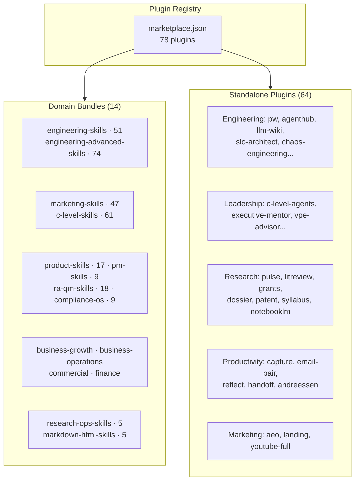

<div class="skills-hero" markdown>

# Plugins & Marketplace

**78 installable plugins** — 14 domain bundles and 64 standalone packages, distributed through the Claude Code plugin registry and ClawHub.

<p class="skills-hero-sub">Install an entire skill domain or a single tool with one command. Compatible with Claude Code, OpenAI Codex, Gemini CLI, and OpenClaw.</p>

</div>

---

## At a Glance

<div class="grid cards" markdown>

-   :material-puzzle-outline:{ .lg .middle } **78 Plugins**

    ---

    14 domain bundles + 64 standalone packages

-   :material-domain:{ .lg .middle } **17 Domains**

    ---

    Engineering, marketing, product, C-level, compliance, commercial, operations, research, finance, productivity, and more

-   :material-toolbox-outline:{ .lg .middle } **345 Skills**

    ---

    Every skill in the library is installable through a plugin

-   :material-sync:{ .lg .middle } **4 Platforms**

    ---

    Claude Code, OpenAI Codex, Gemini CLI, OpenClaw — single repo, all platforms

</div>

---

## Quick Install

=== "Claude Code"

    ```bash
    # Add the marketplace
    /plugin marketplace add alirezarezvani/claude-skills

    # Install a domain bundle
    /plugin install engineering-skills@claude-code-skills

    # Or install a standalone plugin
    /plugin install research-orchestrator@claude-code-skills
    ```

=== "OpenAI Codex"

    ```bash
    git clone https://github.com/alirezarezvani/claude-skills.git
    cd claude-skills
    ./scripts/codex-install.sh
    ```

=== "Gemini CLI"

    ```bash
    git clone https://github.com/alirezarezvani/claude-skills.git
    cd claude-skills
    python3 scripts/sync-gemini-skills.py --verbose
    ```

=== "OpenClaw"

    ```bash
    curl -sL https://raw.githubusercontent.com/alirezarezvani/claude-skills/main/scripts/openclaw-install.sh | bash
    ```

---

## Plugin Architecture



---

## Domain Bundles

Domain bundles install an entire skill domain — every skill, Python tool, reference doc, and template in that folder. Use these when you want comprehensive coverage for a functional area.

| Bundle | Skills | What you get | Browse |
|---|:-:|---|---|
| `engineering-skills` | 51 | Full engineering team: architecture, frontend, backend, QA, DevOps, SecOps, AI/ML, data, Playwright Pro, self-improving agent | [:octicons-arrow-right-24:](../skills/engineering-team/index.md) |
| `engineering-advanced-skills` | 74 | Agent designer, RAG architect, MCP server builder, CI/CD, SLO architect, chaos engineering, security auditing, tech debt | [:octicons-arrow-right-24:](../skills/engineering/index.md) |
| `product-skills` | 17 | PM toolkit (RICE, PRDs), agile PO, UX research, discovery, analytics, SaaS scaffolder, Apple HIG expert | [:octicons-arrow-right-24:](../skills/product-team/index.md) |
| `marketing-skills` | 47 | Content, SEO, AEO, CRO, paid channels, growth, intelligence, sales enablement — 8 specialist pods | [:octicons-arrow-right-24:](../skills/marketing-skill/index.md) |
| `c-level-skills` | 61 | Full C-suite advisors, founder-mode boardroom, decision logger, scenario war room, M&A playbook | [:octicons-arrow-right-24:](../skills/c-level-advisor/index.md) |
| `ra-qm-skills` | 18 | ISO 13485, MDR 2017/745, FDA 510(k)/PMA, ISO 27001, GDPR, CAPA, ISO 14971 risk management | [:octicons-arrow-right-24:](../skills/ra-qm-team/index.md) |
| `compliance-os` | 9 | Audit-prep orchestrator: readiness and evidence checklists for ISO 13485, ISO 27001, SOC 2, GDPR, FDA QSR, EU AI Act, ISO 42001 | [:octicons-arrow-right-24:](../skills/compliance-os/index.md) |
| `pm-skills` | 9 | Senior PM, scrum master, Jira/Confluence experts, Atlassian admin with bundled remote MCP | [:octicons-arrow-right-24:](../skills/project-management/index.md) |
| `business-growth-skills` | 5 | Customer success, sales engineering, revenue operations, contract & proposal writer | [:octicons-arrow-right-24:](../skills/business-growth/index.md) |
| `business-operations-skills` | 7 | Process mapping, vendor management, capacity planning, internal comms, knowledge ops, procurement | [:octicons-arrow-right-24:](../skills/business-operations/index.md) |
| `commercial-skills` | 8 | Pricing strategy, deal desk, partnerships, channel economics, commercial policy, RFP response, forecasting | [:octicons-arrow-right-24:](../skills/commercial/index.md) |
| `finance-skills` | 4 | Financial analyst (DCF, ratios, budgets), SaaS metrics coach, business investment advisor | [:octicons-arrow-right-24:](../skills/finance/index.md) |
| `research-ops-skills` | 5 | Clinical study design, R&D program finance, market sizing/surveys, product research synthesis | [:octicons-arrow-right-24:](../skills/research-ops/index.md) |
| `markdown-html-skills` | 5 | Markdown-to-HTML converters: branded long-form docs, two-column code reviews, keyboard-navigable slide decks | [:octicons-arrow-right-24:](../skills/markdown-html/index.md) |

Install any bundle with:

```bash
/plugin install <bundle-name>@claude-code-skills
```

---

## Standalone Highlights

Standalone plugins install a single skill or toolkit. Use these when you need one specific capability without the full domain bundle.

### Research (8 plugins)

| Plugin | What it does |
|---|---|
| `research-orchestrator` | **Hybrid router + fallback** — classifies your question and routes to a specialist, or runs its own 8-step research workflow |
| `pulse` | Multi-source recency research (Reddit / HN / X / web) with sentiment |
| `litreview` | Academic literature review with PICO/SPIDER frameworks |
| `grants` | NIH grant-funding intelligence |
| `dossier` | Decision-grade entity research |
| `patent` | Patent prior-art and IP landscape |
| `syllabus` | Course supplementary reading lists (bundled DOCX generator) |
| `notebooklm` | Google NotebookLM browser automation |

### Productivity (5 plugins)

| Plugin | What it does |
|---|---|
| `capture-skill` | Brain-dump-to-action workspace |
| `email-pair` | Paired inbox-setup + inbox-triage with a 7-file knowledge-base contract |
| `reflect-skill` | Light-prompt reflection journal |
| `handoff-productivity` | Session-handoff notes with redaction linting and auto-load hooks |
| `andreessen` | Market-first decision pressure-testing in Marc Andreessen mode |

### Engineering favorites

`pw` (Playwright Pro), `self-improving-agent`, `agenthub`, `autoresearch-agent`, `llm-wiki`, `slo-architect`, `chaos-engineering`, `kubernetes-operator`, `feature-flags-architect`, `karpathy-coder`, `write-a-skill`, `security-guidance`, `universal-scraping-architect` — browse them all in [Engineering — Advanced](../skills/engineering/index.md).

---

## Plugin Structure

Every plugin follows the same minimal schema for maximum portability:

```json
{
  "name": "plugin-name",
  "description": "What it does",
  "version": "2.10.0",
  "author": { "name": "Author Name" },
  "homepage": "https://...",
  "repository": "https://...",
  "license": "MIT",
  "skills": ["./skills/<name>"]
}
```

Two approved extension fields are permitted:

- **`source`** (object) — provenance metadata for Path-B megaprompt-derived skills (productivity, marketing, research).
- **`attribution`** (object) — credit metadata for MIT-licensed external derivatives (`caveman`, `grill-me`, `grill-with-docs`).

!!! info "ClawHub Registry"
    Plugins are distributed via [ClawHub](https://clawhub.com) as the public registry. The `cs-` prefix is used only when a slug is already taken by another publisher — repo folder names remain unchanged.

---

## Compatibility Matrix

| Platform | Bundle Install | Standalone Install | Slash Commands | Agents |
|----------|:-:|:-:|:-:|:-:|
| **Claude Code** | :material-check: | :material-check: | :material-check: | :material-check: |
| **OpenAI Codex** | :material-check: | :material-check: | :material-close: | :material-close: |
| **Gemini CLI** | :material-check: | :material-check: | :material-close: | :material-close: |
| **OpenClaw** | :material-check: | :material-check: | :material-close: | :material-close: |

!!! tip "Full feature support"
    Slash commands (like `/cs:research`, `/pw:generate`) and agent spawning (like `cs-research`) are Claude Code features. On other platforms the underlying skills and Python tools work — just without the command/agent wrappers.

---

## All 78 Plugins at a Glance

| Plugin | Type | Category | Source |
|---|---|---|---|
| `business-growth-skills` | Bundle | business-growth | `./business-growth` |
| `commercial-skills` | Bundle | commercial | `./commercial` |
| `compliance-os` | Bundle | compliance | `./compliance-os` |
| `ra-qm-skills` | Bundle | compliance | `./ra-qm-team` |
| `engineering-advanced-skills` | Bundle | development | `./engineering` |
| `engineering-skills` | Bundle | development | `./engineering-team` |
| `markdown-html-skills` | Bundle | documentation | `./markdown-html` |
| `finance-skills` | Bundle | finance | `./finance` |
| `c-level-skills` | Bundle | leadership | `./c-level-advisor` |
| `marketing-skills` | Bundle | marketing | `./marketing-skill` |
| `business-operations-skills` | Bundle | operations | `./business-operations` |
| `product-skills` | Bundle | product | `./product-team` |
| `pm-skills` | Bundle | project-management | `./project-management` |
| `research-ops-skills` | Bundle | research-ops | `./research-ops` |
| `compliance-team-eu-ai-act` | Standalone | compliance | `./ra-qm-team/compliance-team-eu-ai-act` |
| `compliance-team-iso42001` | Standalone | compliance | `./ra-qm-team/compliance-team-iso42001` |
| `apple-hig-expert` | Standalone | design | `./product-team/apple-hig-expert` |
| `a11y-audit` | Standalone | development | `./engineering-team/a11y-audit` |
| `agenthub` | Standalone | development | `./engineering/agenthub` |
| `autoresearch-agent` | Standalone | development | `./engineering/autoresearch-agent` |
| `behuman` | Standalone | development | `./engineering/behuman` |
| `caveman` | Standalone | development | `./engineering/caveman` |
| `chaos-engineering` | Standalone | development | `./engineering/chaos-engineering` |
| `claude-coach` | Standalone | development | `./engineering/claude-coach` |
| `code-tour` | Standalone | development | `./engineering/code-tour` |
| `data-quality-auditor` | Standalone | development | `./engineering/data-quality-auditor` |
| `demo-video` | Standalone | development | `./engineering/demo-video` |
| `docker-development` | Standalone | development | `./engineering/docker-development` |
| `feature-flags-architect` | Standalone | development | `./engineering/feature-flags-architect` |
| `google-workspace-cli` | Standalone | development | `./engineering-team/google-workspace-cli` |
| `grill-me` | Standalone | development | `./engineering/grill-me` |
| `grill-with-docs` | Standalone | development | `./engineering/grill-with-docs` |
| `handoff-engineering` | Standalone | development | `./engineering/handoff` |
| `helm-chart-builder` | Standalone | development | `./engineering/helm-chart-builder` |
| `karpathy-coder` | Standalone | development | `./engineering/karpathy-coder` |
| `kubernetes-operator` | Standalone | development | `./engineering/kubernetes-operator` |
| `llm-cost-optimizer` | Standalone | development | `./engineering/llm-cost-optimizer` |
| `prompt-governance` | Standalone | development | `./engineering/prompt-governance` |
| `pw` | Standalone | development | `./engineering-team/playwright-pro` |
| `security-guidance` | Standalone | development | `./engineering/security-guidance` |
| `self-improving-agent` | Standalone | development | `./engineering-team/self-improving-agent` |
| `slo-architect` | Standalone | development | `./engineering/slo-architect` |
| `snowflake-development` | Standalone | development | `./engineering-team/snowflake-development` |
| `statistical-analyst` | Standalone | development | `./engineering/statistical-analyst` |
| `terraform-patterns` | Standalone | development | `./engineering/terraform-patterns` |
| `universal-scraping-architect` | Standalone | development | `./engineering/universal-scraping-architect` |
| `workflow-builder` | Standalone | development | `./engineering/workflow-builder` |
| `write-a-skill` | Standalone | development | `./engineering/write-a-skill` |
| `collab-proof` | Standalone | engineering | `./engineering/collab-proof` |
| `business-investment-advisor` | Standalone | finance | `./finance/business-investment-advisor` |
| `llm-wiki` | Standalone | knowledge | `./engineering/llm-wiki` |
| `c-level-agents` | Standalone | leadership | `./c-level-advisor/c-level-agents` |
| `chief-ai-officer-advisor` | Standalone | leadership | `./c-level-advisor/chief-ai-officer-advisor` |
| `chief-customer-officer-advisor` | Standalone | leadership | `./c-level-advisor/chief-customer-officer-advisor` |
| `chief-data-officer-advisor` | Standalone | leadership | `./c-level-advisor/chief-data-officer-advisor` |
| `executive-mentor` | Standalone | leadership | `./c-level-advisor/executive-mentor` |
| `general-counsel-advisor` | Standalone | leadership | `./c-level-advisor/general-counsel-advisor` |
| `vpe-advisor` | Standalone | leadership | `./c-level-advisor/vpe-advisor` |
| `aeo` | Standalone | marketing | `./marketing-skill/skills/aeo` |
| `landing` | Standalone | marketing | `./marketing/landing` |
| `video-content-strategist` | Standalone | marketing | `./marketing-skill/video-content-strategist` |
| `youtube-full` | Standalone | marketing | `./marketing-skill/skills/youtube-full` |
| `agile-product-owner` | Standalone | product | `./product-team/agile-product-owner` |
| `code-to-prd` | Standalone | product | `./product-team/code-to-prd` |
| `research-summarizer` | Standalone | product | `./product-team/research-summarizer` |
| `andreessen` | Standalone | productivity | `./productivity/andreessen` |
| `capture-skill` | Standalone | productivity | `./productivity/capture` |
| `email-pair` | Standalone | productivity | `./productivity/email` |
| `handoff-productivity` | Standalone | productivity | `./productivity/handoff` |
| `reflect-skill` | Standalone | productivity | `./productivity/reflect` |
| `dossier` | Standalone | research | `./research/dossier` |
| `grants` | Standalone | research | `./research/grants` |
| `litreview` | Standalone | research | `./research/litreview` |
| `notebooklm` | Standalone | research | `./research/notebooklm` |
| `patent` | Standalone | research | `./research/patent` |
| `pulse` | Standalone | research | `./research/pulse` |
| `research-orchestrator` | Standalone | research | `./research/research` |
| `syllabus` | Standalone | research | `./research/syllabus` |

---

## FAQ

??? question "What's the difference between a bundle and a standalone plugin?"
    **Bundles** install all skills in a domain (for example, `marketing-skills` installs all 48 marketing skills). **Standalone** plugins install a single skill or toolkit (for example, `pulse` installs just the recency-research skill). Standalone plugins are subsets of their parent bundle when applicable — installing both is safe but redundant.

??? question "What is the research orchestrator?"
    `research-orchestrator` is a **hybrid router + fallback** that classifies any research question deterministically and either delegates to one of six specialists (pulse, litreview, grants, dossier, patent, syllabus, notebooklm) at ≥2-signal confidence, or runs its own 8-step plan-decompose-search-synthesize-cite workflow when no specialist matches. Routing transparency is mandatory — it never delegates silently.

??? question "Can I install multiple plugins?"
    Yes. Plugins are designed to coexist without conflicts. Each skill is self-contained with no cross-dependencies.

??? question "Do plugins require API keys or paid services?"
    No. All Python tools use the standard library only. Some skills reference external services (AWS, Google Workspace, Stripe, NIH RePORTER, Reddit/HN APIs) but follow a BYOK (bring-your-own-key) pattern — you use your own accounts.

??? question "How do I update plugins?"
    Re-run the install command. Plugins follow semantic versioning aligned with repository releases.

??? question "What is ClawHub?"
    [ClawHub](https://clawhub.com) is the public registry for Claude Code plugins — think of it as npm for AI agent skills. The `cs-` prefix is used only when a plugin slug conflicts with another publisher.

??? question "Can I use skills without installing anything?"
    Yes. There are [6 Custom GPTs for ChatGPT](../custom-gpts.md) that package Agent Skills into a conversational interface — no installation, no API keys. Just click and chat.
