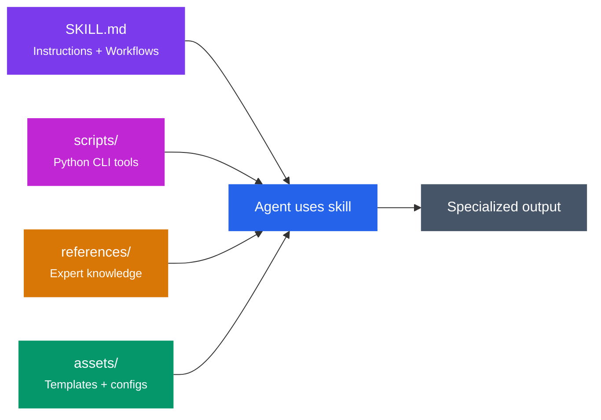

<div class="skills-hero" markdown>

# Skills Library

345 production-ready agent skills across 17 domains — every one self-contained, security-audited, and installable in one command.
{ .skills-hero-sub }

</div>

<div class="grid cards" markdown>

-   :material-counter:{ .lg .middle } **345 Skills**

    ---

    Across 17 professional domains

-   :material-language-python:{ .lg .middle } **570+ Tools**

    ---

    Python CLI tools, all stdlib-only

-   :material-package-variant-closed:{ .lg .middle } **78 Plugins**

    ---

    Install bundles or individual skills

-   :material-devices:{ .lg .middle } **13 Platforms**

    ---

    Claude Code, Codex, Gemini CLI, Cursor & more

</div>

## Quick Install

=== "Claude Code"

    ```bash
    # Add the marketplace
    /plugin marketplace add alirezarezvani/claude-skills

    # Install any skill bundle
    /plugin install engineering-skills@claude-code-skills
    /plugin install marketing-skills@claude-code-skills
    /plugin install c-level-skills@claude-code-skills
    ```

=== "Gemini CLI"

    ```bash
    git clone https://github.com/alirezarezvani/claude-skills.git
    cd claude-skills && python3 scripts/sync-gemini-skills.py
    ```

=== "OpenAI Codex"

    ```bash
    git clone https://github.com/alirezarezvani/claude-skills.git
    cd claude-skills && python3 scripts/sync-codex-skills.py
    ```

=== "OpenClaw"

    ```bash
    git clone https://github.com/alirezarezvani/claude-skills.git
    cd claude-skills && bash scripts/openclaw-install.sh
    ```

[Full Install Guide :octicons-arrow-right-24:](../getting-started.md){ .md-button .md-button--primary }
[GitHub :fontawesome-brands-github:](https://github.com/alirezarezvani/claude-skills){ .md-button }

---

## Architecture

Every skill follows the same self-contained package pattern — no cross-dependencies, no external APIs, no setup required:



---

## Domains at a Glance

<div class="grid cards" markdown>

-   :material-cog:{ .lg .middle } **Engineering — Core** <span class="skill-count">51</span>

    ---

    The full engineering team: architecture, frontend, backend, fullstack, QA, DevOps, SecOps, AI/ML, data, cloud architects (AWS/Azure/GCP), Playwright testing, and a self-improving agent.

    [:octicons-arrow-right-24: Browse skills](engineering-team/index.md)

-   :material-lightning-bolt:{ .lg .middle } **Engineering — Advanced** <span class="skill-count">74</span>

    ---

    Agent-native infrastructure: agent designer, RAG architect, MCP server builder, CI/CD pipelines, SLO architect, chaos engineering, kubernetes operators, security auditing, tech debt tracking.

    [:octicons-arrow-right-24: Browse skills](engineering/index.md)

-   :material-bullseye-arrow:{ .lg .middle } **Product** <span class="skill-count">17</span>

    ---

    Product manager toolkit (RICE, PRDs), agile PO, UX research, product discovery, analytics, experiment design, SaaS scaffolding, and an Apple HIG expert.

    [:octicons-arrow-right-24: Browse skills](product-team/index.md)

-   :material-bullhorn:{ .lg .middle } **Marketing** <span class="skill-count">47</span>

    ---

    Eight specialist pods — content, SEO, AEO (answer engine optimization), CRO, paid channels, growth, intelligence, and sales enablement — with bundled Python analytics tools.

    [:octicons-arrow-right-24: Browse skills](marketing-skill/index.md)

-   :material-star-circle:{ .lg .middle } **C-Level Advisory** <span class="skill-count">61</span>

    ---

    A virtual executive team: CEO through General Counsel, Chief Data/AI/Customer Officers, VP Engineering, founder-mode boardroom orchestration, decision logging, and strategy frameworks.

    [:octicons-arrow-right-24: Browse skills](c-level-advisor/index.md)

-   :material-shield-check:{ .lg .middle } **Regulatory & Quality** <span class="skill-count">18</span>

    ---

    HealthTech/MedTech compliance: ISO 13485 QMS, MDR 2017/745, FDA 510(k)/PMA, ISO 27001 ISMS, GDPR/DSGVO, CAPA, and ISO 14971 risk management.

    [:octicons-arrow-right-24: Browse skills](ra-qm-team/index.md)

-   :material-shield-lock:{ .lg .middle } **Compliance OS** <span class="skill-count">9</span>

    ---

    An audit-prep operating system: readiness assessments and evidence checklists for ISO 13485, ISO 27001, SOC 2, GDPR, FDA QSR, EU AI Act, and ISO 42001.

    [:octicons-arrow-right-24: Browse skills](compliance-os/index.md)

-   :material-clipboard-check:{ .lg .middle } **Project Management** <span class="skill-count">9</span>

    ---

    Senior PM, scrum master, Jira and Confluence experts, Atlassian admin, meeting analyzer — with a bundled Atlassian Remote MCP for live Jira/Confluence automation.

    [:octicons-arrow-right-24: Browse skills](project-management/index.md)

-   :material-trending-up:{ .lg .middle } **Business & Growth** <span class="skill-count">5</span>

    ---

    Customer success with health scoring, sales engineering with RFP analysis, revenue operations with pipeline metrics, and a contract & proposal writer.

    [:octicons-arrow-right-24: Browse skills](business-growth/index.md)

-   :material-cog-outline:{ .lg .middle } **Business Operations** <span class="skill-count">7</span>

    ---

    Internal ops for BizOps leads: process mapping with bottleneck detection, vendor scorecards, Erlang-C capacity planning, internal comms, knowledge ops, and procurement optimization.

    [:octicons-arrow-right-24: Browse skills](business-operations/index.md)

-   :material-handshake:{ .lg .middle } **Commercial** <span class="skill-count">8</span>

    ---

    Per-deal economics: pricing strategy with Van Westendorp analysis, deal desk scoring, partnership tiers, channel economics, commercial policy, RFP response, and forecasting.

    [:octicons-arrow-right-24: Browse skills](commercial/index.md)

-   :material-currency-usd:{ .lg .middle } **Finance** <span class="skill-count">4</span>

    ---

    Financial analyst (DCF valuation, ratio analysis, budgeting, forecasting), SaaS metrics coach (ARR, MRR, churn, CAC, LTV, NRR), and a business investment advisor.

    [:octicons-arrow-right-24: Browse skills](finance/index.md)

-   :material-magnify:{ .lg .middle } **Research** <span class="skill-count">8</span>

    ---

    Academic research specialists — literature review, NIH grants, patents, entity dossiers, syllabi, NotebookLM automation — behind a hybrid orchestrator that routes your question.

    [:octicons-arrow-right-24: Browse skills](research/index.md)

-   :material-flask:{ .lg .middle } **Research Operations** <span class="skill-count">5</span>

    ---

    Enterprise research ops: clinical study design with power analysis, R&D program finance, TAM/SAM/SOM market sizing, survey methodology, and product research synthesis.

    [:octicons-arrow-right-24: Browse skills](research-ops/index.md)

-   :material-lightning-bolt-outline:{ .lg .middle } **Productivity** <span class="skill-count">6</span>

    ---

    Personal operating system: brain-dump capture, inbox setup and triage, reflection journaling, session handoff, and Andreessen-style market-first decision checks.

    [:octicons-arrow-right-24: Browse skills](productivity/index.md)

-   :material-language-html5:{ .lg .middle } **Markdown to HTML** <span class="skill-count">5</span>

    ---

    Turn markdown into beautiful single-file HTML with your brand — long-form documents with sticky TOC and search, two-column code reviews, and keyboard-navigable slide decks.

    [:octicons-arrow-right-24: Browse skills](markdown-html/index.md)

-   :material-web:{ .lg .middle } **Landing Pages** <span class="skill-count">1</span>

    ---

    Generate a complete single-file HTML landing page with four design styles, GSAP animation patterns, and a WCAG-validated brand palette.

    [:octicons-arrow-right-24: Browse skills](marketing/index.md)

</div>

---

## How Skills Work

<div class="grid cards" markdown>

-   :material-numeric-1-circle:{ .lg .middle } **Install**

    ---

    Add a skill bundle or individual skill via the plugin marketplace.

    ```bash
    /plugin install engineering-skills@claude-code-skills
    ```

-   :material-numeric-2-circle:{ .lg .middle } **Trigger**

    ---

    Skills activate automatically when your prompt matches their domain — or invoke them directly with a slash command.

-   :material-numeric-3-circle:{ .lg .middle } **Execute**

    ---

    The agent follows the SKILL.md workflows, runs the bundled Python tools for analysis, and consults the reference knowledge bases.

-   :material-numeric-4-circle:{ .lg .middle } **Output**

    ---

    You get structured, reviewable results — reports, code, configurations, strategies, or audit-ready documentation.

</div>

!!! tip "All tools are stdlib-only"
    Every Python script that ships with a skill uses only the standard library — zero `pip install` required, no API keys, no LLM calls. Scripts support both human-readable and `--json` output for automation.
